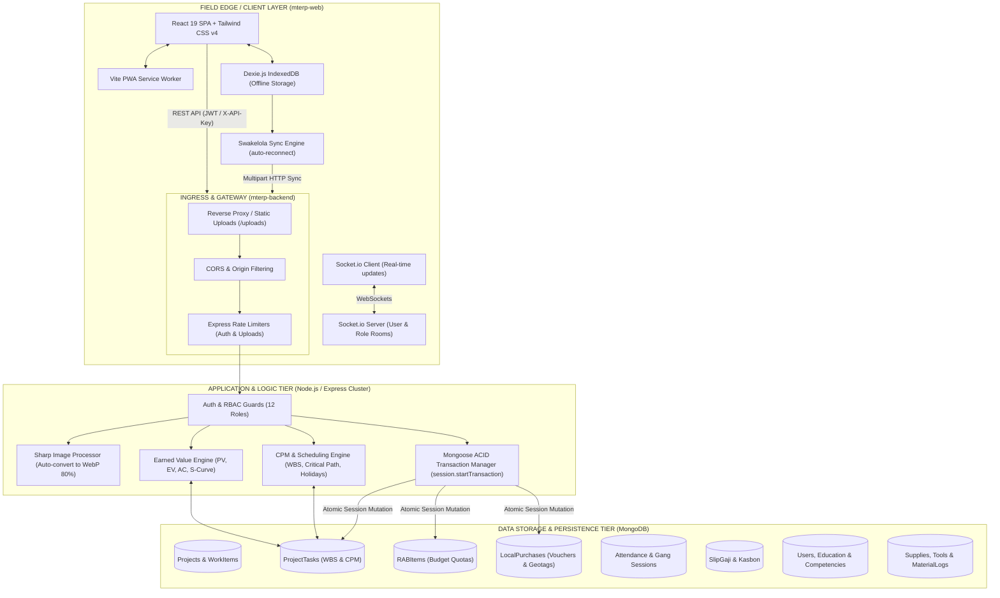

# MTERP — Enterprise Construction & Operations Management System

> **High-Performance Construction ERP, Statutory Swakelola SCM, Field Biometrics, CPM/EVM Project Scheduling & Multi-Tier Financial Governance**

[](file:///c:/Users/CorSec/Documents/personal/MTERPweb/package.json)
[](file:///c:/Users/CorSec/Documents/personal/MTERPweb/mterp-web)
[](file:///c:/Users/CorSec/Documents/personal/MTERPweb/mterp-backend)
[](file:///c:/Users/CorSec/Documents/personal/MTERPweb/mterp-web/src/services/offlineDb.ts)
[](#)

---

## 📖 Table of Contents

1. [System Overview & Purpose](#-system-overview--purpose)
2. [End-to-End System Architecture](#-end-to-end-system-architecture)
3. [How This App Works (Core Operational Lifecycles)](#-how-this-app-works-core-operational-lifecycles)
   - [3.1 Authentication & 12-Role RBAC Governance](#31-authentication--12-role-rbac-governance)
   - [3.2 Project Planning, WBS, Gantt & Earned Value (EVM)](#32-project-planning-wbs-gantt--earned-value-evm)
   - [3.3 Swakelola SCM & Direct Local Purchases (ACID Guaranteed)](#33-swakelola-scm--direct-local-purchases-acid-guaranteed)
   - [3.4 Offline Field Edge Resilience & Background Sync Engine](#34-offline-field-edge-resilience--background-sync-engine)
   - [3.5 Daily Site Reporting & WebP Image Optimization](#35-daily-site-reporting--webp-image-optimization)
   - [3.6 Smart Attendance: Geolocation, Selfies & Gang Sessions](#36-smart-attendance-geolocation-selfies--gang-sessions)
   - [3.7 Automated Payroll (Slip Gaji) & Kasbon Management](#37-automated-payroll-slip-gaji--kasbon-management)
   - [3.8 Tool & Plant Asset Tracking with Condition Photos](#38-tool--plant-asset-tracking-with-condition-photos)
   - [3.9 Human Resources, Education & Competency Licenses](#39-human-resources-education--competency-licenses)
   - [3.10 Real-Time Collaboration & External API Keys](#310-real-time-collaboration--external-api-keys)
4. [Role-Based Access Control (RBAC) Matrix](#-role-based-access-control-rbac-matrix)
5. [Technology Stack](#-technology-stack)
6. [Repository & Directory Structure](#-repository--directory-structure)
7. [Installation & Local Setup Guide](#-installation--local-setup-guide)
   - [Backend Setup](#backend-setup)
   - [Frontend Setup](#frontend-setup)
   - [Default Test Accounts](#default-test-accounts)
8. [Production Deployment & PM2 Cluster Execution](#-production-deployment--pm2-cluster-execution)
9. [API Route Reference](#-api-route-reference)
10. [Stability & Performance Architecture](#-stability--performance-architecture)

---

## 🌟 System Overview & Purpose

**MTERP** is a modern, full-stack Enterprise Resource Planning (ERP) platform architected specifically for commercial construction contractors and statutory **Swakelola** engineering projects.

Operating construction sites presents severe operational challenges: unstable cellular networks at remote locations, distributed teams (subcontractors, mandors, site engineers, project directors), stringent government/client audit requirements (such as *Uang Muka Kerja* / UMK capital advance tracking), and the necessity for zero-drift financial control.

MTERP bridges the divide between corporate headquarters and field execution through:
* **Statutory Swakelola SCM:** Hard-capped budget line items (*Rencana Anggaran Biaya* / RAB) tied to Work Breakdown Structure (WBS) codes, validated atomically via database transactions to prevent budget overruns.
* **Offline Field Edge Resilience:** A Progressive Web App (PWA) client powered by **Dexie.js (IndexedDB)** and background synchronization, allowing site managers to record purchases, take GPS geotagged receipts, and submit logs even with zero network connectivity.
* **Full-Spectrum CPM/EVM Planning:** Integrated Gantt chart scheduling with Critical Path Method (CPM), forward/backward passes, dependency cycle detection, Indonesian holiday calendar support, and Earned Value Management metrics ($PV, EV, AC, CPI, SPI$) with cumulative S-Curve ($Kurva\ S$) curves.
* **Biometric & Gang Attendance:** Field-ready attendance verification featuring selfie camera captures, GPS geofencing, and **Foreman Gang Sessions** enabling mandors to check-in an entire crew via a single group photo.
* **Audit-Proof Payroll & Kasbon:** Automated salary generation incorporating daily rates, overtime multipliers, and automated cash advance (*kasbon*) deductions, finalized by Director approval and QR-code certified PDF payslips.

---

## 🏗️ End-to-End System Architecture



---

## ⚙️ How This App Works (Core Operational Lifecycles)

### 3.1 Authentication & 12-Role RBAC Governance
* **Registration & Activation:** New users sign up with their credentials, personal data, and selected role. The backend generates a secure 6-digit cryptographic OTP (`crypto.randomInt`) sent via SMTP email. Upon OTP verification, accounts enter a pending state until verified by the **Owner** or authenticated administrators.
* **Stateless JWT Sessions:** Successful authentication returns a signed JSON Web Token (JWT) encapsulating `userId` and `role`. Tokens are stored in browser local storage and dispatched via HTTP `Authorization: Bearer <token>` headers through Axios request interceptors.
* **Auto-Logout & Session Interception:** When a 401 Unauthorized status is intercepted, the frontend dispatches a custom `auth:unauthorized` event to reset local credentials and redirect immediately to the login view.
* **Hierarchical Role Model:** A 12-tier Role-Based Access Control (RBAC) hierarchy controls route permissions, UI component visibility in [Sidebar.tsx](file:///c:/Users/CorSec/Documents/personal/MTERPweb/mterp-web/src/components/layout/Sidebar.tsx), and backend endpoint execution via `authorize(...)` middleware.

---

### 3.2 Project Planning, WBS, Gantt & Earned Value (EVM)
The planning module transforms high-level contracts into executable Work Breakdown Structures:

```
[Contract / Project Creation]
            │
            ▼
[WBS Tree Generation] ──► Auto-indented WBS Codes (1.1, 1.1.2)
            │
            ▼
[Dependency Linking] ──► FS / SS / FF / SF with Lead/Lag Days
            │
            ├─► Cycle Detection (Prevents infinite dependency loops)
            ├─► Indonesian Holiday Calendar (Excludes national holidays & Sundays)
            └─► Critical Path Method (Calculates Earliest/Latest Start & Float)
            │
            ▼
[Execution & EVM Engine]
            ├─► Planned Value (PV)
            ├─► Earned Value (EV = % Progress × Cost Weight)
            ├─► Actual Cost (AC = Realized Ledger Expenditure)
            ├─► Schedule & Cost Indices (SPI, CPI)
            └─► Cumulative S-Curve Generation (Kurva S)
            │
            ▼
[Interoperability] ◄──► Bi-directional MS Excel (.xlsx) & MS Project XML Import/Export
```

* **Dynamic Schedule Recalculation:** When task dates or durations shift, `recalculateProjectSchedule()` performs a forward and backward pass, adjusting all downstream successor tasks according to working day calendars.
* **Resource Sheet & Leveling:** Project resources (Manpower, Materials, Plant) can be leveled automatically using `levelProjectResources()`, which pushes non-critical tasks within their available float to eliminate peak workforce overallocations.
* **S-Curve & EVM Metrics:** Visualizes planned progress against actual execution over calendar weeks, calculating Cost Variance ($CV = EV - AC$) and Schedule Variance ($SV = EV - PV$) to warn project managers of potential delays or budget overruns before they materialize.

---

### 3.3 Swakelola SCM & Direct Local Purchases (ACID Guaranteed)
In Indonesian construction, **Swakelola** projects involve self-managed execution where capital advances (*Uang Muka Kerja* / UMK) must strictly adhere to the approved budget (*Rencana Anggaran Biaya* / RAB).

```
Field Purchaser (Local Hardware / Depot)
            │
            ├─► Collects Physical Receipt & Generates Voucher (e.g. KW-001/SWK/2026)
            ├─► Takes Camera Photo of Receipt
            └─► Captures GPS Geotag (Latitude / Longitude)
            │
            ▼
POST /api/projects/:projectId/local-purchases
            │
            ▼
[Mongoose withTransaction() ACID Session]
    1. Lock RABItem & Validate: (requestedQty <= budgetedQty - realizedQty)
       └───► If exceeded: Throws 422 Unprocessable Entity (Budget Cap Exceeded)
    2. Enforce Unique Voucher Constraint
    3. Persist LocalPurchase record with status: 'SUBMITTED'
    4. Atomically Increment:
       RABItem.realizedQuantity += qty
       RABItem.realizedAmount   += totalPrice
       ProjectTask.realizedQuantity += qty
       ProjectTask.actualCost   += totalPrice
            │
            ▼
[Commit Transaction] ──► Realized instantly on Project Dashboard
```

* **Verification Workflow:** Vouchers are reviewed by Site Managers or Directors. If a voucher is marked `REJECTED`, the system executes a reverse ACID transaction that decrements the realized amounts, restoring the remaining budget quota for that WBS item.

---

### 3.4 Offline Field Edge Resilience & Background Sync Engine
Construction job sites frequently experience intermittent or non-existent cellular coverage. MTERP implements an **Offline Field Edge Architecture** using Dexie.js (client-side IndexedDB wrapper):

1. **Local IndexedDB Persistence:** When a field engineer submits a direct purchase while offline, [LocalPurchaseForm.tsx](file:///c:/Users/CorSec/Documents/personal/MTERPweb/mterp-web/src/components/swakelola/LocalPurchaseForm.tsx) intercepts the submission and stores the record in `SwakelolaOfflineDB` with `syncStatus: 'PENDING'` and a compressed Base64 representation of the receipt photo.
2. **Offline Visual Indicators:** The header and Swakelola tabs display live status badges indicating offline mode and the count of un-synchronized vouchers.
3. **Automatic Network Event Listeners:** [syncEngine.ts](file:///c:/Users/CorSec/Documents/personal/MTERPweb/mterp-web/src/services/syncEngine.ts) registers `window.addEventListener('online', ...)`. Upon network reconnection:
   - The queue reads all pending records.
   - Base64 images are reconstructed into standard browser `File` objects.
   - The engine sends multipart `FormData` requests sequentially to the backend.
   - Upon HTTP 201 response, the record is flagged `syncStatus: 'SYNCED'`.
   - The engine dispatches a global `swakelola:sync-completed` event to automatically refresh server data grids.

---

### 3.5 Daily Site Reporting & WebP Image Optimization
* **Comprehensive Field Logs:** Field supervisors submit daily progress reports logging weather conditions (Sunny, Rainy, Heavy Rain, Cloudy), active work items with percentage progress, headcount breakdown by worker category, materials consumed from site staging, and heavy equipment hours.
* **Automated WebP Conversion Pipeline:** When site photos are uploaded, the backend [sharp](https://github.com/lovell/sharp) processing middleware converts raw JPEG/PNG images into **WebP format at 80% compression quality**. Original uncompressed files are unlinked, saving approximately 60–75% of disk storage and bandwidth during mobile image loading.
* **Cost-Weighted Physical Progress:** As daily reports update work item completion percentages, the project model calculates the aggregate physical progress weighted by each item's planned cost contribution.

---

### 3.6 Smart Attendance: Geolocation, Selfies & Gang Sessions
The attendance subsystem supports two flexible operational modes:

1. **Individual Worker Mode (`/attendance`):**
   - Individual workers or engineers open the camera on their mobile device.
   - The app reads GPS coordinates via the HTML5 Geolocation API.
   - The user captures a verification selfie photo.
   - Backend registers timestamp, coordinates, and photo, calculating whether the check-in falls within standard working hours or qualifies for overtime (*lembur*).

2. **Foreman / Mandor Gang Sessions (`/group-attendance`):**
   - Designed for rapid morning site entry where individual check-ins cause gate congestion.
   - The site supervisor or foreman takes a single group photo of the working crew.
   - The supervisor checks off all workers present in that shift.
   - A single transaction creates attendance entries for all selected workers, linked to the `AttendanceSession` record and shared photo.

---

### 3.7 Automated Payroll (Slip Gaji) & Kasbon Management
MTERP features an integrated payroll computation engine designed around Indonesian construction wage conventions:

$$\text{Net Salary} = (\text{Present Days} \times \text{Daily Wage}) + \text{Overtime Pay} + \text{Allowances} - \text{Kasbon Deductions} - \text{BPJS}$$

* **Cash Advance (Kasbon) Integration:** Workers can submit kasbon loan requests via `/my-payments`. Once approved by the Director, active balances appear automatically as deductions in the next payroll calculation cycle.
* **Supervisor Preview & Director Authorization:** Supervisors generate a draft payroll calculation for the week or month. Directors review the breakdown and authorize the payout with their approval signature.
* **QR-Code Certified PDF Generation:** The client application uses `jspdf` and `jspdf-autotable` to generate professional pay slips on demand. Each slip includes a cryptographically verifiable QR code for field audit validation.

---

### 3.8 Tool & Plant Asset Tracking with Condition Photos
* **Asset Tracking & Status:** Construction machinery, power tools, and survey instruments are tracked by serial numbers, brand, and condition (*Baik*, *Rusak*, *Perbaikan*).
* **Project Dispatch & Return Workflow:** Tools are checked out to specific projects. When tools are returned to the central warehouse, supervisors must capture inspection photos to document physical condition and assess damages against project budgets.

---

### 3.9 Human Resources, Education & Competency Licenses
* **Enterprise Worker Registry:** [Users.tsx](file:///c:/Users/CorSec/Documents/personal/MTERPweb/mterp-web/src/pages/Users.tsx) provides a high-density, accessible enterprise data grid with sticky index columns, multi-tier density toggles, dynamic column filtering, and bulk Excel import/export.
* **Statutory Compliance:** Tracks worker contracts (Permanent, Contract, Daily Casual, Internship), bank accounts, BPJS Ketenagakerjaan, and BPJS Kesehatan.
* **Education & Competency Certifications:** Stores formal education records alongside certified competency licenses (*SKA / SKT* construction licenses) with issue and expiration dates, generating alerts prior to license expirations.

---

### 3.10 Real-Time Collaboration & External API Keys
* **Socket.io WebSocket Infrastructure:** Connected users join authenticated socket rooms identified by their `userId` and role. Status updates, approvals, material alerts, and task assignments push instant UI alerts without requiring manual page refreshes.
* **External Integration via `X-API-Key`:** Third-party construction safety and monitoring applications (e.g. *EnercoSafe*) can interface with MTERP endpoints by passing a validated `X-API-Key` header, allowing cross-platform project telemetry exchange.

---

## 👥 Role-Based Access Control (RBAC) Matrix

| User Role | Dashboard & KPIs | Project Creation | WBS & Gantt Scheduling | Swakelola Local Purchases | Daily Site Reports | Attendance & Sessions | Payroll & Kasbon Approvals | User & System Admin |
| :--- | :---: | :---: | :---: | :---: | :---: | :---: | :---: | :---: |
| **Owner** | Full View | Create / Delete | Full Access | Verify / Reject | Full Oversight | Oversee All | Final Authorize | Full Management |
| **President / Operational Director** | Full View | Create / Edit | Full Access | Verify / Reject | Approve Reports | Oversee All | Final Authorize | View / Assign |
| **Site Manager** | Project View | Edit Assigned | Edit Schedule | Submit & Verify | Submit & Review | Oversee Gangs | Review Drafts | View Team |
| **Supervisor** | Project View | View Assigned | Update Progress | Submit Vouchers | Submit Reports | Gang Check-in | Generate Preview | View Team |
| **Admin Project** | Financial View | View Assigned | View Plan | Record Vouchers | View Reports | Attendance Logs | Compute Wages | Manage Data |
| **Asset Admin** | Tool/Material | View Assigned | Resource View | Record Purchases | Material Logs | View Logs | View Only | View Only |
| **Foreman / Mandor** | Mobile Home | No Access | Task Updates | No Access | Assist Log | Gang Check-in | View Gang Pay | No Access |
| **Worker / Tukang / Helper** | Personal Portal | No Access | View Tasks | No Access | No Access | Self Check-in | View Personal Pay | Personal Profile |

---

## 💻 Technology Stack

### Frontend Architecture (`mterp-web`)
| Package / Tool | Version | Purpose |
| :--- | :--- | :--- |
| **React** | `^19.2.0` | Core UI library utilizing functional components and concurrent rendering |
| **TypeScript** | `~5.9.3` | Strict static typing, generic DTO interfaces, and compile-time validation |
| **Vite** | `^7.2.4` | Development server with instant HMR and Rollup-based production chunking |
| **Tailwind CSS** | `^4.2.1` | "Field Rugged" high-contrast design system and responsive utility styling |
| **Dexie.js** | `^4.4.6` | IndexedDB client wrapper for the offline Swakelola purchase store |
| **VitePWA** | `^0.19.8` | Service worker precaching, Web App Manifest, and offline asset availability |
| **Socket.io Client** | `^4.8.3` | Real-time bi-directional WebSocket client for live event notifications |
| **Recharts & Chart.js** | `^3.7.0` / `^4.5.1` | S-Curve (Kurva S), Earned Value trends, and executive KPI visualizations |
| **jsPDF & AutoTable** | `^4.2.0` / `^5.0.7` | Client-side generation of QR-stamped salary slips and PDF project reports |
| **GSAP** | `^3.14.2` | High-performance micro-animations and smooth layout transitions |
| **i18next** | `^25.8.13` | Multi-language localization support (Indonesian & English) |
| **Lucide React** | `^0.563.0` | Accessible semantic vector iconography |

### Backend Architecture (`mterp-backend`)
| Package / Tool | Version | Purpose |
| :--- | :--- | :--- |
| **Node.js & Express** | `18+` / `^4.18.2` | Enterprise RESTful API server with asynchronous middleware pipelines |
| **MongoDB & Mongoose** | `8.0+` / `^8.0.3` | NoSQL document database utilizing schemas, indexes, and ACID sessions |
| **Socket.io** | `^4.8.3` | Real-time WebSocket server with JWT authentication and room dispatchers |
| **Sharp** | `^0.35.3` | Image transformation pipeline converting JPEG/PNG to compressed WebP |
| **ExcelJS** | `^4.4.0` | Parsing and compiling complex multi-sheet Excel files for WBS/HR import/export |
| **Bcryptjs & JWT** | `^2.4.3` / `^9.0.2` | Password hashing (salt rounds: 12) and stateless Bearer token authorization |
| **Express Rate Limit** | `^8.2.1` | DoS mitigation across authentication and multipart file upload routes |
| **PM2** | Latest | Production process manager running cluster mode with memory threshold restarts |

---

## 📁 Repository & Directory Structure

```
MTERPweb/
├── ERP_SYSTEM_UI_UX_AUDIT_REPORT.md  # Detailed enterprise UX & data grid audit report
├── SWAKELOLA_SCM_REMEDIATION_PLAN.md # Swakelola architectural SCM execution roadmap
├── README.md                         # Main repository architecture and user manual
│
├── mterp-backend/                    # Express.js REST API Server
│   ├── .env.example                  # Environment template
│   ├── ecosystem.config.cjs          # PM2 cluster configuration
│   ├── package.json
│   ├── uploads/                      # Uploaded WebP photos, receipts, documents
│   └── src/
│       ├── server.js                 # HTTP & Socket.io server bootstrap
│       ├── seed.js                   # Master database seeder with realistic test data
│       ├── middleware/
│       │   ├── auth.js               # JWT & role authorization guards
│       │   ├── apiKeyAuth.js         # External API key validation
│       │   ├── rateLimiter.js        # IP request throttling
│       │   └── upload.js             # Multer multipart storage engine
│       ├── models/                   # Mongoose schema definitions (21 models)
│       │   ├── Project.js            # Projects, work items, and document metadata
│       │   ├── ProjectTask.js        # WBS line items, predecessors, and EVM data
│       │   ├── RABItem.js            # Swakelola budget quotas and realized amounts
│       │   ├── LocalPurchase.js      # Direct field purchase vouchers with geotags
│       │   ├── Attendance.js         # Individual check-ins and overtime records
│       │   ├── AttendanceSession.js  # Foreman gang check-in sessions
│       │   ├── DailyReport.js        # Weather, progress, and site photo logs
│       │   ├── SlipGaji.js           # Payroll calculations and approvals
│       │   ├── User.js               # Employee registry, contracts, competencies
│       │   └── ...
│       ├── routes/                   # API endpoint route controllers
│       │   ├── projectPlan.js        # WBS, CPM recalculation, S-Curve, imports
│       │   ├── localPurchases.js     # ACID purchase registration and verification
│       │   ├── projects.js           # Project CRUD, daily reports, progress
│       │   ├── attendance.js         # Check-in, check-out, recap tables
│       │   ├── slipgaji.js           # Wage calculation and authorization
│       │   └── ...
│       └── utils/
│           ├── date.js               # Standardized Asia/Jakarta (WIB) date math
│           ├── scheduling.js         # CPM forward/backward passes and leveling
│           ├── earnedValue.js        # EVM metrics ($PV, EV, AC, CPI, SPI$)
│           ├── transaction.js        # Mongoose ACID transaction wrapper
│           └── notify.js             # Socket.io notification dispatchers
│
└── mterp-web/                        # React 19 Client Application (PWA)
    ├── index.html                    # Single-page HTML entry point
    ├── vite.config.ts                # Vite build, PWA manifest, and manual chunking
    ├── package.json
    └── src/
        ├── App.tsx                   # Main routing table and context providers
        ├── api/api.ts                # Axios client with interceptors and API methods
        ├── components/
        │   ├── gantt/                # Interactive Gantt, S-Curve, EVM, and WBS tables
        │   ├── swakelola/            # Local purchase form and offline sync dialogs
        │   ├── users/                # Enterprise user data grid with density toggles
        │   └── layout/               # AppLayout, Navbar, and responsive Sidebar
        ├── contexts/                 # React Contexts (Auth, Notification, Sidebar, Swakelola)
        ├── pages/                    # 30 application view pages
        │   ├── Dashboard.tsx         # Executive KPI summary
        │   ├── Projects.tsx          # Project registry
        │   ├── ProjectDetail.tsx     # Project 360-degree control panel
        │   ├── ProjectPlan.tsx       # Microsoft Project-grade scheduling engine
        │   ├── ProjectSwakelola.tsx  # Swakelola SCM, RAB quotas, voucher list
        │   ├── DailyReport.tsx       # Field daily site reporting
        │   ├── Attendance.tsx        # Personal biometric attendance
        │   ├── GroupAttendance.tsx   # Foreman gang photo check-in
        │   ├── SlipGaji.tsx          # Payroll generation and PDF slips
        │   ├── Users.tsx             # Employee and competency records
        │   └── ...
        ├── services/
        │   ├── offlineDb.ts          # Dexie.js IndexedDB schema definition
        │   └── syncEngine.ts         # Background offline purchase sync engine
        └── utils/                    # Formatting, image helpers, and calculations
```

---

## 🚀 Installation & Local Setup Guide

### Prerequisites
* **Node.js:** `v18.x` or `v20.x` LTS recommended
* **MongoDB:** Local instance running on port `27017` or a MongoDB Atlas URI
* **Package Manager:** `npm` (included with Node.js)

---

### Backend Setup

1. **Navigate to the backend directory:**
   ```bash
   cd mterp-backend
   ```

2. **Install dependencies:**
   ```bash
   npm install
   ```

3. **Configure Environment Variables:**
   Copy the `.env.example` file to create your `.env`:
   ```bash
   cp .env.example .env
   ```
   Ensure the following settings match your environment:
   ```ini
   PORT=3001
   MONGODB_URI=mongodb://localhost:27017/mterp
   JWT_SECRET=your-super-secure-jwt-key-for-development
   CORS_ORIGIN=http://localhost:5173,http://localhost:3000
   
   # Optional SMTP Settings for OTP emails (defaults to mock/bypass if unconfigured)
   EMAIL_HOST=smtp.gmail.com
   EMAIL_PORT=587
   EMAIL_USER=your-email@gmail.com
   EMAIL_PASS=your-app-password
   ```

4. **Seed Database with Test Data:**
   Populate test users, sample construction projects, WBS tasks, tools, and RAB items:
   ```bash
   npm run seed
   ```

5. **Start Development Server:**
   ```bash
   npm run dev
   ```
   The backend API will start at `http://localhost:3001`.

---

### Frontend Setup

1. **Navigate to the web client directory:**
   ```bash
   cd ../mterp-web
   ```

2. **Install dependencies:**
   ```bash
   npm install
   ```

3. **Configure Frontend API Endpoint:**
   Create a `.env` file in `mterp-web` (or rely on the default fallback to port 3001):
   ```ini
   VITE_API_URL=http://localhost:3001/api
   ```

4. **Start Vite Development Server:**
   ```bash
   npm run dev
   ```
   Open your browser at `http://localhost:5173`.

---

### Default Test Accounts
After running `npm run seed`, you can sign in using any of the following accounts (all default passwords are `password123`):

| Username | Role | Full Name | Access Level |
| :--- | :--- | :--- | :--- |
| `owner` | `owner` | Ir. H. Syamil Alfatih | Full System Root Access & User Admin |
| `director` | `director` | Ir. Bambang Wicaksono, MM | Executive Financial & Project Authorization |
| `sitemanager` | `site_manager` | Ir. Budi Santoso, ST, MT | Project Scheduling & Voucher Verification |
| `supervisor` | `supervisor` | Hendro Prasetyo, ST | Site Operations, Daily Reports, Gang Check-in |
| `adminproject` | `admin_project`| Siti Rahmawati, SE | Cost Control, Material Logs, Wage Computation |
| `tukang1` | `foreman` | Ahmad Subarjo | Gang Attendance Sessions & Task Execution |
| `worker1` | `worker` | Dedi Kurniawan | Self Attendance Check-in & Personal Payslips |

---

## ⚡ Production Deployment & PM2 Cluster Execution

For production environments, the backend should be executed across all available CPU cores using **PM2 in Cluster Mode** to guarantee high availability and zero-downtime reloads.

```bash
cd mterp-backend

# 1. Start cluster using ecosystem configuration
npm run pm2:start

# 2. Monitor CPU, memory, and cluster health
npm run pm2:monit

# 3. View aggregated real-time logs
npm run pm2:logs

# 4. Zero-downtime reload after updates
npm run pm2:restart
```

### Production Build for Frontend
Compile the optimized, code-split production bundle:
```bash
cd mterp-web
npm run build
```
The production bundle will be output to `mterp-web/dist/`, configured with automatic service worker registration and manual chunking for optimal client caching.

---

## 📡 API Route Reference

### Authentication & Profiles (`/api/auth`)
* `POST /register` — Register a new user account
* `POST /verify` — Verify email via OTP code
* `POST /login` — Authenticate and receive a JWT Bearer token
* `GET /me` — Retrieve the currently authenticated profile
* `PUT /profile` — Update user profile details
* `PUT /profile/photo` — Upload and convert a new profile photo to WebP

### Projects & Operations (`/api/projects`)
* `GET /` — List accessible projects (supports `X-API-Key` for external integrations)
* `POST /` — Create a new construction project (Owner / Director)
* `GET /:id` — Retrieve full project details, work items, and financial summary
* `PUT /:id/progress` — Update overall progress percentage
* `POST /:id/daily-report` — Submit a daily site report with WebP compressed photos
* `GET /:id/daily-reports` — List historical daily reports
* `POST /:id/documents` — Upload project documents (Shop drawings, HSE, contracts)

### Project Planning, WBS & S-Curve (`/api/projects/:projectId/plan`)
* `GET /tasks` — Retrieve hierarchical WBS task tree with dependencies
* `POST /tasks` — Add a new task line item
* `PUT /tasks/:taskId` — Update dates, duration, percent complete, or cost
* `PUT /tasks/:taskId/indent` & `outdent` — Structure WBS hierarchy levels
* `PUT /tasks/:taskId/predecessors` — Link task dependencies (FS, SS, FF, SF)
* `POST /recalculate` — Execute CPM forward/backward schedule pass
* `GET /critical-path` — Identify critical path tasks with zero float
* `GET /earned-value` — Calculate EVM parameters ($PV, EV, AC, CPI, SPI$)
* `GET /s-curve` — Generate cumulative planned vs actual S-Curve data points
* `GET /export-excel` & `POST /import-excel` — Bi-directional MS Excel plan sync
* `GET /export-xml` & `POST /import-xml` — Bi-directional MS Project XML plan sync

### Swakelola SCM & Local Purchases (`/api/projects/:projectId/local-purchases`)
* `GET /` — List purchase vouchers with remaining RAB quota summary
* `POST /` — **Record Direct Local Purchase** (Atomic Mongoose ACID transaction)
* `PUT /:purchaseId/verify` — Verify or Reject voucher (Auto rollback on rejection)

### Attendance & Gang Sessions (`/api/attendance` & `/api/attendance-session`)
* `POST /checkin` — Worker selfie check-in with GPS coordinates
* `PUT /checkout` — Worker check-out with time calculation
* `POST /permit` — Submit leave or medical permit with doctor's certificate
* `GET /` — List attendance records with date and user filters
* `GET /recap-table` — Multi-day attendance recap grid for payroll
* `POST /api/attendance-session` — **Foreman Gang Session Check-In** with single group photo

### Payroll & Kasbon (`/api/slipgaji` & `/api/kasbon`)
* `GET /preview` — Generate weekly/monthly draft payroll calculations
* `POST /generate` — Create slip gaji records for the selected cycle
* `POST /:id/authorize` — Director/Owner cryptographic approval of payslip
* `GET /my` — Worker self-service endpoint for personal payslips
* `GET /api/kasbon` & `POST /api/kasbon` — Request and manage employee cash advances

### Tools & Equipment Logistics (`/api/tools`)
* `GET /dashboard` — Tool inventory counts, availability, and condition breakdown
* `POST /` — Add new tool/equipment asset with condition photo
* `PUT /:id/assign` — Assign tool to a construction project
* `PUT /:id/return` — Check-in returned tool with post-use inspection photo

---

## 🛡️ Stability & Performance Architecture

* **Rollup & React 19 Chunking:** Configured with manual vendor splitting (`vendor-react`, `vendor-charts`, `vendor-pdf`, `vendor-ui`, `vendor-anim`, `vendor-i18n`) in [vite.config.ts](file:///c:/Users/CorSec/Documents/personal/MTERPweb/mterp-web/vite.config.ts) to eliminate large payload bottlenecks.
* **Lean Database Querying:** Read-only `GET` endpoints utilize Mongoose `.lean()`, bypassing full document hydration to reduce backend heap memory consumption by over 65%.
* **Parallel Promise Concurrency:** Aggregation pipelines and dashboard statistics utilize `Promise.all()`, avoiding sequential request waterfalls.
* **ACID Transaction Rollback:** Critical multi-document financial entries (such as `LocalPurchase` and `RABItem`) are protected by explicit replica-set sessions. Any mid-flight error triggers an immediate database abort, preserving zero-drift accounting integrity.
* **Automated Media Optimization:** Built-in Sharp WebP conversion limits long-term disk consumption while accelerating site photo viewing on mobile networks.

---

## 📄 License
Proprietary software. Copyright © 2026 MTERP Engineering Solutions. All rights reserved.