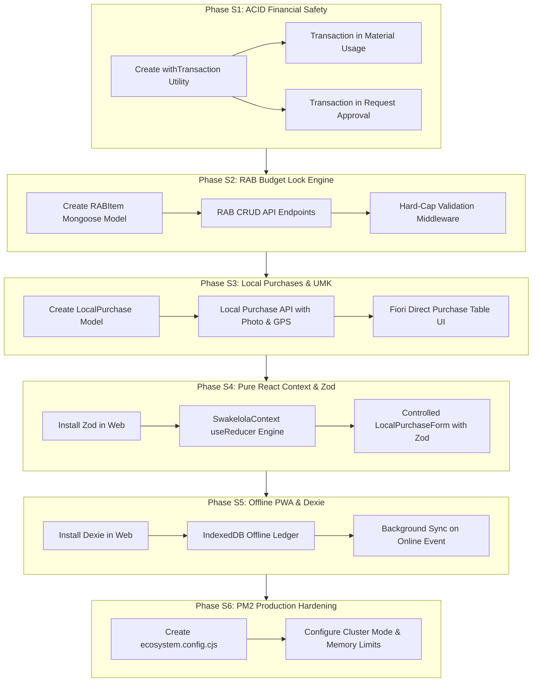

# Swakelola Supply Chain Management (SCM) Remediation Plan: Enterprise Execution Roadmap

**Target Platform:** MTERPweb (Construction & Enterprise Operations Management Platform)  
**Source Audit:** Swakelola SCM Architectural Code Audit  
**Standard Evaluated Against:** [`Skills-SupplyChain-Swakelola-v2.md`](file:///c:/Users/CorSec/Documents/personal/MTERPweb/.agents/skills/ERP-tables-UX/UI/Skills-SupplyChain-Swakelola-v2.md) (*React + Node.js + MongoDB + PM2*)  
**Target Completion:** 6 Phased SCM Milestones (S1 to S6)  
**Primary Goal:** Transform MTERP from a generic commercial procurement tool into a fully certified, statutory-compliant Swakelola SCM platform with ACID transaction safety, RAB budget caps, offline field capability, and PM2 cluster stability.

---

## 1. Architectural Strategy & Domain Comparison

Swakelola construction projects require absolute financial accountability, where public funds or client capital advances (*Uang Muka Kerja - UMK*) must match physical progress with zero budget overruns.

```
┌─────────────────────────────────────────────────────────────────────────────┐
│                    SWAKELOLA SCM SYSTEM ARCHITECTURE                        │
├─────────────────────────────────────────────────────────────────────────────┤
│                                                                             │
│  [ RAB Baseline Lock ] ──► [ WBS Line Items & Unit Caps ]                   │
│           │                                                                 │
│           ├─► Real-time Cap Validation (Zod + Backend Middleware)           │
│           │                                                                 │
│  [ Field Edge (Offline PWA) ]                                               │
│     ├─► Dexie.js (IndexedDB) Offline Purchase Ledger                        │
│     ├─► Geotagged Receipt Photo Capture (lat/lng)                           │
│     └─► Background Sync Engine on Network Reconnect                         │
│           │                                                                 │
│           ▼ (HTTPS / REST)                                                  │
│  [ Node.js / Express API Cluster (PM2) ]                                     │
│     ├─► Auth & Multi-Tier Role Authorization Guard Rails                    │
│     ├─► Mongoose ACID Session Isolation (session.startTransaction)          │
│     └─► Atomic Ledger Realization ($inc / rollback protection)              │
│           │                                                                 │
│           ▼                                                                 │
│  [ MongoDB Enterprise Replica Set ]                                         │
│     ├── RABItems (budgetedQty, unitRate, realizedQty, realizedAmount)       │
│     ├── LocalPurchases (vouchers, supplier, geotags, photos, UMK links)     │
│     ├── Supplies & MaterialLogs (warehouse stock & physical usage)          │
│     └── PhysicalProgressLedger (S-Curve & Kemajuan Fisik vs Penyerapan)     │
│                                                                             │
└─────────────────────────────────────────────────────────────────────────────┘
```

### Commercial SCM vs. Swakelola SCM Mapping in MTERP
| Operational Vector | Commercial Contractor (Current) | Swakelola SCM (Remediated Target) |
| :--- | :--- | :--- |
| **Budget Control** | Single aggregate `totalBudget` in `Project` | Granular `RABItem` models tied to WBS codes with hard quantity caps |
| **Material Sourcing** | Requisitions (`Request.js`) ➔ `Supply.js` | Direct Local Purchases (`LocalPurchase.js`) via UMK vouchers & receipt photos |
| **Transaction Safety**| Non-atomic sequential `.save()` calls | Mongoose ACID Transactions (`session.startTransaction()`) |
| **Form Integrity** | Custom JS conditionals with `alert()` | Controlled components + Zod schemas + live remaining budget indicators |
| **Field Edge Resilience** | Static asset precaching only | Dexie.js IndexedDB local storage + automatic background synchronization |
| **Runtime Reliability** | `nodemon` / single-process `node src/server.js` | PM2 Cluster Mode with automatic memory threshold restart (`1G`) |

---

## 2. Phase S1: Backend ACID Transaction Safety & Session Isolation

### Objective
Eliminate phantom inventory deductions and desynchronized database states by wrapping all multi-document financial and material operations within Mongoose ACID transactions.

### Target Files
- [`mterp-backend/src/routes/projects.js`](file:///c:/Users/CorSec/Documents/personal/MTERPweb/mterp-backend/src/routes/projects.js) (Material usage logging)
- [`mterp-backend/src/routes/requests.js`](file:///c:/Users/CorSec/Documents/personal/MTERPweb/mterp-backend/src/routes/requests.js) (Approval to Supply transition)
- *New Utility:* `mterp-backend/src/utils/transaction.js`

### Implementation Tasks
1. **Reusable Mongoose Transaction Wrapper (`src/utils/transaction.js`):**
   ```javascript
   const mongoose = require('mongoose');

   async function withTransaction(workFn) {
     const session = await mongoose.startSession();
     session.startTransaction();
     try {
       const result = await workFn(session);
       await session.commitTransaction();
       return result;
     } catch (error) {
       await session.abortTransaction();
       throw error;
     } finally {
       session.endSession();
     }
   }

   module.exports = { withTransaction };
   ```
2. **Refactor Material Usage Logging (`POST /api/projects/:id/material-logs`):**
   - Execute stock validation, `supply.totalQtyUsed` increment, and `MaterialLog` record creation within a single session transaction.
   - Use atomic `$inc` rather than in-memory read-modify-write to guarantee concurrency safety during simultaneous field entries.
3. **Refactor Material Request Approval (`PUT /api/requests/:id`):**
   - Update `Request` status and insert or increment `Supply` in an atomic transaction. If either operation fails, the transaction rolls back cleanly.

### Acceptance Criteria
- [ ] Simulating an error during `MaterialLog.save()` rolls back `Supply.totalQtyUsed` without leaving phantom stock deductions.
- [ ] High-frequency concurrent logging requests do not produce race-condition inventory overwrites.

---

## 3. Phase S2: RAB Budget Lock Engine & WBS Schema Architecture

### Objective
Enforce statutory budget discipline where no direct purchase or requisition can be approved if it exceeds the remaining allocated quota in the *Rencana Anggaran Biaya* (RAB).

### Target Files
- *New Model:* `mterp-backend/src/models/RABItem.js`
- *New Routes:* `mterp-backend/src/routes/rab.js`
- [`mterp-backend/src/models/index.js`](file:///c:/Users/CorSec/Documents/personal/MTERPweb/mterp-backend/src/models/index.js)
- [`mterp-backend/src/server.js`](file:///c:/Users/CorSec/Documents/personal/MTERPweb/mterp-backend/src/server.js)

### Implementation Tasks
1. **Design `RABItem` Mongoose Model:**
   ```javascript
   const mongoose = require('mongoose');

   const rabItemSchema = new mongoose.Schema({
     projectId: { type: mongoose.Schema.Types.ObjectId, ref: 'Project', required: true, index: true },
     wbsCode: { type: String, required: true, trim: true }, // e.g., "1.1.2"
     description: { type: String, required: true, trim: true },
     unitOfMeasure: { 
       type: String, 
       enum: ['CUM', 'CFT', 'MT', 'SQM', 'MTR', 'KG', 'NOS', 'HOK', 'JAM', 'LS', 'PCS', 'ZAK'], 
       required: true 
     },
     budgetedQuantity: { type: Number, required: true, min: 0 },
     unitRate: { type: Number, required: true, min: 0 },
     totalBudget: { type: Number, required: true },
     committedQuantity: { type: Number, default: 0 },
     realizedQuantity: { type: Number, default: 0 },
     realizedAmount: { type: Number, default: 0 },
   }, { timestamps: true });

   rabItemSchema.pre('validate', function(next) {
     if (this.budgetedQuantity && this.unitRate) {
       this.totalBudget = this.budgetedQuantity * this.unitRate;
     }
     next();
   });

   module.exports = mongoose.model('RABItem', rabItemSchema);
   ```
2. **Expose RAB Management Endpoints (`/api/projects/:id/rab`):**
   - `GET /api/projects/:id/rab`: Fetch all WBS budget lines with budgeted vs. realized metrics.
   - `POST /api/projects/:id/rab`: Batch import or create RAB items (Director/Project Manager only).
   - `PUT /api/projects/:id/rab/:itemId`: Adjust budget allocation (requires managerial authorization).
3. **Hard-Cap Validation Middleware:**
   - Intercept purchase and request routes: calculate `(realizedQuantity + requestedQuantity)`. If this exceeds `budgetedQuantity`, reject with HTTP `422 Unprocessable Entity`:  
     `"Sisa kuota mata anggaran ${wbsCode} hanya ${remaining} ${unitOfMeasure}"`.

### Acceptance Criteria
- [ ] Users cannot commit or purchase quantities exceeding the budgeted amount without explicit managerial reallocation.
- [ ] WBS hierarchy and unit rates calculate total budget automatically.

---

## 4. Phase S3: Direct Local Purchases (*Pembelian Langsung*) & UMK Vouchers

### Objective
Enable jobsite teams to log on-the-spot material purchases funded by Work Advance Cash (*Uang Muka Kerja*), complete with receipt photos, vendor credentials, and GPS coordinates.

### Target Files
- *New Model:* `mterp-backend/src/models/LocalPurchase.js`
- *New Route:* `mterp-backend/src/routes/localPurchases.js`
- [`mterp-backend/src/routes/index.js`](file:///c:/Users/CorSec/Documents/personal/MTERPweb/mterp-backend/src/routes/index.js)
- *New Frontend Page/Tab:* `mterp-web/src/pages/LocalPurchases.tsx` (or integrated into `Materials.tsx`)

### Implementation Tasks
1. **Design `LocalPurchase` Mongoose Schema:**
   ```javascript
   const mongoose = require('mongoose');

   const localPurchaseSchema = new mongoose.Schema({
     projectId: { type: mongoose.Schema.Types.ObjectId, ref: 'Project', required: true, index: true },
     rabItemId: { type: mongoose.Schema.Types.ObjectId, ref: 'RABItem', required: true, index: true },
     voucherNumber: { type: String, required: true, unique: true }, // e.g. "KW-001/SWK/2026"
     purchaserName: { type: String, required: true },
     supplierName: { type: String, required: true },
     itemDescription: { type: String, required: true },
     quantity: { type: Number, required: true, min: 0.01 },
     unitPrice: { type: Number, required: true, min: 0 },
     totalPrice: { type: Number, required: true },
     receiptPhotoUrl: { type: String, required: true },
     geotagLocation: {
       lat: { type: Number },
       lng: { type: Number },
       addressText: { type: String }
     },
     status: { 
       type: String, 
       enum: ['DRAFT', 'SUBMITTED', 'VERIFIED', 'REJECTED'], 
       default: 'SUBMITTED' 
     },
     verifiedBy: { type: mongoose.Schema.Types.ObjectId, ref: 'User' },
     verifiedAt: { type: Date }
   }, { timestamps: true });

   module.exports = mongoose.model('LocalPurchase', localPurchaseSchema);
   ```
2. **Implement Local Purchase Handler with Transactional Ledger Sync:**
   - In `routes/localPurchases.js`: Upload receipt photo, extract geolocation from payload, validate RAB quota, create `LocalPurchase` record, and increment `RABItem.realizedQuantity` and `RABItem.realizedAmount` inside an ACID transaction.
3. **Frontend Swakelola Purchase Register:**
   - Build high-density SAP Fiori table: Columns for Voucher No, Item, Store/Supplier, Qty, Unit Price, Total, Geotag Badge, Photo Preview Modal, and Verification Action.

### Acceptance Criteria
- [ ] Direct purchases cannot be created without a valid voucher number, supplier name, and receipt photograph.
- [ ] Saving a purchase immediately updates the corresponding RAB item's realized metrics atomically.

---

## 5. Phase S4: Pure React Context State & Zod Form Validation

### Objective
Eliminate ad-hoc form validation and maintain clean, zero-bloat state architecture in strict compliance with the pure React rule (NO Redux, NO Zustand, NO Jotai, NO TanStack Query).

### Target Files
- *New Context:* `mterp-web/src/contexts/SwakelolaContext.tsx`
- *New Component:* `mterp-web/src/components/swakelola/LocalPurchaseForm.tsx`
- [`mterp-web/package.json`](file:///c:/Users/CorSec/Documents/personal/MTERPweb/mterp-web/package.json) (Add `zod` dependency)

### Implementation Tasks
1. **Install `zod` in `mterp-web`:**
   ```bash
   cd mterp-web && npm install zod
   ```
2. **Build `SwakelolaContext.tsx` using Native `createContext` and `useReducer`:**
   - Manages active project, list of `RABItem`s, loading states, and optimistic quota updates.
   - Provides helper methods: `setActiveProject()`, `fetchRABItems()`, and `updateRABItemLocally()`.
3. **Build `LocalPurchaseForm.tsx` with Zod Schema Validation:**
   ```typescript
   import { z } from 'zod';

   export const purchaseSchema = z.object({
     rabItemId: z.string().min(1, 'Pilih mata anggaran RAB'),
     voucherNumber: z.string().min(3, 'Nomor kuitansi/bukti wajib diisi'),
     purchaserName: z.string().min(2, 'Nama pelaksana/pembeli wajib diisi'),
     supplierName: z.string().min(2, 'Nama toko/supplier lokal wajib diisi'),
     itemDescription: z.string().min(3, 'Deskripsi spesifikasi barang wajib diisi'),
     quantity: z.number().positive('Jumlah kuantitas harus lebih dari 0'),
     unitPrice: z.number().positive('Harga satuan harus lebih dari 0'),
     receiptPhotoUrl: z.string().min(1, 'Foto kuitansi/nota wajib diunggah'),
   });
   ```
   - Dynamically calculates `totalPrice = quantity * unitPrice`.
   - Renders instant remaining budget indicator: *"Sisa kuota: X [Satuan]"*.
   - Displays red validation warnings directly beneath invalid inputs.

### Acceptance Criteria
- [ ] Zero external state management libraries added (Zustand, Redux, TanStack Query remain completely excluded).
- [ ] Invalid forms show precise field-level error messages without browser alert dialogs.

---

## 6. Phase S5: Edge Field Execution & Offline PWA Capabilities (Dexie.js)

### Objective
Ensure jobsite storekeepers and supervisors in remote or low-connectivity zones can log purchases, receipts, and material logs offline, with automatic background synchronization upon network recovery.

### Target Files
- *New Service:* `mterp-web/src/services/offlineDb.ts`
- *New Service:* `mterp-web/src/services/syncEngine.ts`
- [`mterp-web/src/App.tsx`](file:///c:/Users/CorSec/Documents/personal/MTERPweb/mterp-web/src/App.tsx)
- [`mterp-web/package.json`](file:///c:/Users/CorSec/Documents/personal/MTERPweb/mterp-web/package.json) (Add `dexie` dependency)

### Implementation Tasks
1. **Install `dexie` in `mterp-web`:**
   ```bash
   cd mterp-web && npm install dexie
   ```
2. **Build IndexedDB Schema (`src/services/offlineDb.ts`):**
   ```typescript
   import Dexie, { Table } from 'dexie';

   export interface OfflinePurchaseRecord {
     id?: number;
     localUuid: string;
     projectId: string;
     rabItemId: string;
     voucherNumber: string;
     purchaserName: string;
     supplierName: string;
     itemDescription: string;
     quantity: number;
     unitPrice: number;
     totalPrice: number;
     receiptPhotoBase64?: string;
     geotagLocation?: { lat: number; lng: number };
     syncStatus: 'PENDING' | 'SYNCED' | 'ERROR';
     errorMessage?: string;
     createdAt: string;
   }

   export class SwakelolaOfflineDB extends Dexie {
     offlinePurchases!: Table<OfflinePurchaseRecord>;

     constructor() {
       super('SwakelolaOfflineDB');
       this.version(1).stores({
         offlinePurchases: '++id, localUuid, projectId, syncStatus, createdAt',
       });
     }
   }

   export const offlineDb = new SwakelolaOfflineDB();
   ```
3. **Build Background Sync Engine (`src/services/syncEngine.ts`):**
   - Automatically triggered on `window.addEventListener('online', ...)`.
   - Iterates through `PENDING` records in IndexedDB, posts them to `/api/purchases/local`, marks them as `SYNCED`, and alerts the user via a subtle toast notification.

### Acceptance Criteria
- [ ] Disconnecting the network and recording a direct purchase stores the record locally in IndexedDB with `PENDING` status.
- [ ] Reconnecting the network immediately flushes pending vouchers to the server and marks them `SYNCED`.

---

## 7. Phase S6: Production Hardening & PM2 Cluster Configuration

### Objective
Deploy the backend application using Process Manager 2 (PM2) in cluster mode to achieve zero-downtime hot reloads, multi-core CPU scaling, and automatic memory leak recovery.

### Target Files
- *New Config:* `mterp-backend/ecosystem.config.cjs`
- [`mterp-backend/package.json`](file:///c:/Users/CorSec/Documents/personal/MTERPweb/mterp-backend/package.json)

### Implementation Tasks
1. **Create `mterp-backend/ecosystem.config.cjs`:**
   ```javascript
   module.exports = {
     apps: [
       {
         name: 'mterp-backend-api',
         script: './src/server.js',
         instances: 'max', // Clustered across all CPU cores
         exec_mode: 'cluster',
         autorestart: true,
         watch: false,
         max_memory_restart: '1G',
         env_production: {
           NODE_ENV: 'production',
           PORT: 5000,
         },
         log_date_format: 'YYYY-MM-DD HH:mm:ss Z',
         error_file: './logs/pm2-err.log',
         out_file: './logs/pm2-out.log',
         combine_logs: true,
       },
     ],
   };
   ```
2. **Add PM2 Control Scripts to `mterp-backend/package.json`:**
   ```json
   "scripts": {
     "start": "node src/server.js",
     "dev": "nodemon src/server.js",
     "pm2:start": "pm2 start ecosystem.config.cjs --env production",
     "pm2:reload": "pm2 reload mterp-backend-api",
     "pm2:stop": "pm2 stop mterp-backend-api",
     "pm2:monit": "pm2 monit"
   }
   ```

### Acceptance Criteria
- [ ] Running `npm run pm2:start` launches the backend across multi-core cluster workers.
- [ ] Server automatically restarts any worker exceeding 1GB memory without dropping active HTTP connections.

---

## 8. Implementation Dependency Graph



---

## 9. Risk Mitigation & Non-Regression Safeguards

1. **Zero Disruption to Live Projects:**
   - Existing commercial projects using `totalBudget` and flat `workItems` will retain backwards compatibility. `RABItem` will serve as an optional or default sub-ledger without breaking legacy project views.
2. **Replica Set Prerequisite for Transactions:**
   - MongoDB transactions require a replica set (single-node or multi-node). A fallback check in `withTransaction` will execute standard atomic operations if the MongoDB instance is standalone.
3. **Pure React Architectural Purity:**
   - Under no circumstances will Redux, Zustand, or TanStack Query be introduced. All state will remain 100% native via React Context, `useReducer`, and `useState`.

---

*Plan formulated autonomously in strict compliance with `Skills-SupplyChain-Swakelola-v2.md`.*  
*Ready for systematic execution upon user authorization.*
