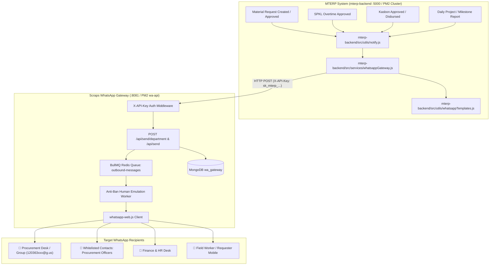

# WhatsApp Notification Integration Plan: Material Requests & Cross-Department Gateway

**Author / Maintainer:** Antigravity Engineering  
**System Target:** MTERP Enterprise System (`MTERPweb`)  
**WhatsApp Gateway Target:** Scraps WA Gateway (`../Scraps`, Port 8081)  
**Date:** October 2026  
**Status:** Validated for Production Deployment  

---

## 1. Executive Summary & Objective

This integration plan details the architecture, data flow, API contracts, and implementation steps to connect **MTERPweb** with the standalone WhatsApp Gateway located in [`../Scraps`](file:///c:/Users/CorSec/Documents/personal/Scraps).

The primary objective is twofold:
1. **Material Request Procurement Automation:** Instantly dispatch rich WhatsApp notifications to the **Procurement Department** and designated procurement officers whenever a material request is submitted on-site. When requests are approved or rejected, notify both the Procurement team (for PO/sourcing action) and the field requester on their personal mobile devices.
2. **Cross-Department Correspondence Engine:** Establish a reusable, role- and department-aware WhatsApp correspondence bridge across MTERP modules (Overtime/SPKL, Kasbon, Daily Reports, and Swakelola SCM) mapping to corresponding corporate divisions (Finance, Operations, Project Delivery, HR, and Executive).
3. **100% Production Compatibility:** Fully aligned with the active PM2 process cluster configuration, TypeScript compilation pipeline, database boundaries, and security rules of your current production environment.

---

## 2. Architecture & Service Topology



### Architectural Guarantees:
- **Zero Monolithic Bloat:** MTERP does not run Puppeteer, Chromium, or `whatsapp-web.js`. The WhatsApp session, browser lifecycle, and QR pairing remain isolated in `Scraps`.
- **Non-Blocking Fire-and-Forget:** All WhatsApp dispatches are asynchronous background tasks. Failures, gateway timeouts, or QR disconnects will **never block or rollback** core MTERP database transactions.
- **Anti-Ban Safety:** Outbound dispatches pass through `Scraps`'s BullMQ queue (`outbound-messages`), which enforces randomized human typing durations (3–8s), simulated read receipts, and batch cooldowns.

---

## 3. Current Production Environment Alignment

We have analyzed both production setups:
1. `MTERPweb`:
   - PM2 app: `mterp-backend-api` defined in [`mterp-backend/ecosystem.config.cjs`](file:///c:/Users/CorSec/Documents/personal/MTERPweb/mterp-backend/ecosystem.config.cjs).
   - Execution Mode: `cluster` with `instances: 'max'`.
   - Production Port: `PORT=5000`.
   - Environment Loader: `require('dotenv').config({ path: path.join(__dirname, '../.env') })` in `server.js`.
2. `Scraps`:
   - PM2 apps: `wa-api` (Port 8081) and `wa-dashboard` (Port 3005) defined in `../Scraps/ecosystem.config.js`.
   - Execution Target: `apps/api/dist/index.js` (Compiled TypeScript!).
   - Execution Mode: `instances: 1` (strictly single instance to prevent Puppeteer session lock collisions).
   - Database: MongoDB `mongodb://127.0.0.1:27017/wa_gateway` + optional Redis `redis://127.0.0.1:6379`.

### Production Feasibility Verification:

| Production Aspect | State in Current Production | How This Plan Ensures Compatibility |
|---|---|---|
| **PM2 Cluster Safety** | `mterp-backend-api` runs with `instances: 'max'` | The WhatsApp client in MTERP is **stateless HTTP fetch**. No shared memory, socket collisions, or lock files in MTERP. All cluster workers safely hit `wa-api` on port 8081. |
| **Puppeteer Session Safety** | `wa-api` in Scraps runs `instances: 1` | Single-instance constraint in `wa-api` guarantees `.wwebjs_auth` Chromium profile is never locked or corrupted by concurrent browser processes. |
| **TypeScript Compilation** | `Scraps` executes from `apps/api/dist/` | Any updates to `Scraps` source code (`apps/api/src/`) must be followed by `npm run build` before reloading `wa-api`. The deployment guide includes this mandatory command. |
| **Network & Loopback** | Both apps reside on the same server | Communication takes place via `http://127.0.0.1:8081` over private loopback. Zero external firewall changes, zero SSL overhead, private and secure. |
| **Database Boundaries** | MTERP (`mterp`) vs Scraps (`wa_gateway`) | Completely isolated MongoDB databases. Integration is 100% via REST API (`X-API-Key`). No shared collections or tight coupling. |
| **Offline Gateway Immunity** | WhatsApp could disconnect (QR expired / phone restart) | MTERP uses a 5-second `AbortSignal.timeout` and strict `try/catch`. If `wa-api` returns 503 or times out, MTERP transactions finish normally without error. |
| **Immediate Kill-Switch** | Operator needs to turn off notifications quickly | Controlled via `WA_GATEWAY_ENABLED=false` in `mterp-backend/.env` without requiring code changes. |

---

## 4. Department Correspondence Mapping Matrix

| MTERP Business Event | Source Module | Target Department(s) in `Scraps` | Recipient Channel | Purpose & Operational Trigger |
|---|---|---|---|---|
| **Material Request Created** | [`requests.js`](file:///c:/Users/CorSec/Documents/personal/MTERPweb/mterp-backend/src/routes/requests.js) | `Procurement`, `Corporate` | Procurement Officers + Procurement Group | **Sourcing Alert:** Item, quantity, urgency, project, date needed, and deep link for fast approval. |
| **Material Request Approved** | [`requests.js`](file:///c:/Users/CorSec/Documents/personal/MTERPweb/mterp-backend/src/routes/requests.js) | `Procurement`, Requester | Procurement Desk + Requester Personal WA | **PO Action Trigger:** Informs procurement to execute purchasing; confirms approval to site requester. |
| **Material Request Rejected** | [`requests.js`](file:///c:/Users/CorSec/Documents/personal/MTERPweb/mterp-backend/src/routes/requests.js) | Requester | Requester Personal WA | **Rejection Notice:** Immediate feedback to site team with rejection reason. |
| **SPKL (Overtime) Submitted** | [`spkl.js`](file:///c:/Users/CorSec/Documents/personal/MTERPweb/mterp-backend/src/routes/spkl.js) | `Operations`, `Project` | Site Manager / Field Supervisor | **Overtime Verification:** Work scope, overtime hours, worker headcount. |
| **SPKL Final Approved / Signed** | [`spkl.js`](file:///c:/Users/CorSec/Documents/personal/MTERPweb/mterp-backend/src/routes/spkl.js) | `Finance`, `Human Resources` | Finance & Payroll Desk | **Payroll Commitment:** Validated overtime ready for payroll / slip gaji export. |
| **Kasbon (Advance) Submitted** | [`kasbon.js`](file:///c:/Users/CorSec/Documents/personal/MTERPweb/mterp-backend/src/routes/kasbon.js) | `Finance`, `Executive` | Finance Manager & Directors | **Cash Advance Review:** Urgent petty cash / advance request alert. |
| **Kasbon Disbursed / Paid** | [`kasbon.js`](file:///c:/Users/CorSec/Documents/personal/MTERPweb/mterp-backend/src/routes/kasbon.js) | Requester, `Finance` | Requester Personal WA + Finance Log | **Disbursement Confirmation:** Funds transferred; reminder to submit receipts. |
| **Project Daily / Milestone Report** | [`projects.js`](file:///c:/Users/CorSec/Documents/personal/MTERPweb/mterp-backend/src/routes/projects.js) | `Project`, `Technical`, `Operations` | Project Manager / Operational Director | **Field Progress & Obstacles:** Weather, critical delays, work percentage. |
| **Swakelola Local Purchase Voucher** | [`projects.js`](file:///c:/Users/CorSec/Documents/personal/MTERPweb/mterp-backend/src/routes/projects.js) | `Procurement`, `Finance` | Procurement Officer & Finance Auditor | **Budget Tracking:** On-site emergency purchase logged against RAB budget. |

---

## 5. API & Integration Contracts

### 5.1 `Scraps` Gateway Enhancement: `POST /api/send/department`

In `../Scraps/apps/api/src/routes/send.ts`, add a department-targeted dispatch endpoint protected by `X-API-Key`.

#### HTTP Request Specification:
- **Method:** `POST`
- **URL:** `http://127.0.0.1:8081/api/send/department`
- **Headers:**
  ```http
  Content-Type: application/json
  X-API-Key: sk_mterp_live_xxxxxxxxxxxxxxxxxxxxxxxx
  ```
- **Body Schema:**
  ```json
  {
    "department": "Procurement",
    "departments": ["Procurement"],
    "message": "...",
    "groupId": "120363xxxxxxxxxxxx@g.us",
    "priority": "normal",
    "metadata": {
      "source": "mterp",
      "event": "material_request_created",
      "entityId": "651a9f...",
      "timestamp": "2026-10-09T08:00:00Z"
    }
  }
  ```

#### Response:
```json
{
  "ok": true,
  "department": "Procurement",
  "recipientsCount": 3,
  "groupDispatched": true,
  "queued": true,
  "jobIds": ["job_001", "job_002", "job_003"]
}
```

#### Production Fallback in `Scraps`:
If no contacts are currently assigned to `department: 'Procurement'` in `Scraps`:
1. It checks if `process.env.WHATSAPP_PHONE` (configured master admin number) is defined and delivers to it.
2. If `groupId` is provided (e.g. `WA_PROCUREMENT_GROUP_ID`), it delivers to the group.
3. It returns `{ ok: true, recipientsCount: 1, fallback: true }`, ensuring messages are never silently lost during onboarding.

---

## 6. MTERP Backend Implementation

### 6.1 Environment Variables Configuration (`mterp-backend/.env`)

Add to `mterp-backend/.env`:
```env
# ── WhatsApp Gateway (Scraps) ────────────────────────────────────────────────
WA_GATEWAY_URL=http://127.0.0.1:8081
WA_GATEWAY_API_KEY=sk_mterp_live_xxxxxxxxxxxxxxxxxxxxxxxx
WA_GATEWAY_ENABLED=true

# Optional Dedicated WhatsApp Group Chat IDs
WA_PROCUREMENT_GROUP_ID=
WA_FINANCE_GROUP_ID=
WA_OPERATIONS_GROUP_ID=

# Deep Linking Base URL for Field Staff Action Buttons
APP_BASE_URL=http://localhost:5173
```

### 6.2 Gateway Client Service (`mterp-backend/src/services/whatsappGateway.js`)

```javascript
/**
 * WhatsApp Gateway Client for Scraps WA Service
 * Location: mterp-backend/src/services/whatsappGateway.js
 */
const BASE_URL = process.env.WA_GATEWAY_URL || 'http://127.0.0.1:8081';
const API_KEY = process.env.WA_GATEWAY_API_KEY;
const ENABLED = process.env.WA_GATEWAY_ENABLED === 'true';

/**
 * Normalizes Indonesian phone numbers into international format without '+'
 * e.g., '0812-3456-7890' -> '6281234567890'
 */
function normalizePhone(rawPhone) {
  if (!rawPhone || typeof rawPhone !== 'string') return null;
  let clean = rawPhone.replace(/\D/g, '');
  if (clean.startsWith('0')) {
    clean = '62' + clean.slice(1);
  } else if (clean.startsWith('8')) {
    clean = '62' + clean;
  }
  return clean.length >= 10 && clean.length <= 15 ? clean : null;
}

/**
 * Dispatches a message to a specific corporate department
 */
async function sendToDepartment(department, message, options = {}) {
  if (!ENABLED || !API_KEY) return { ok: false, skipped: true };

  try {
    const res = await fetch(`${BASE_URL}/api/send/department`, {
      method: 'POST',
      headers: {
        'Content-Type': 'application/json',
        'X-API-Key': API_KEY,
      },
      body: JSON.stringify({
        department,
        message,
        groupId: options.groupId,
        priority: options.priority || 'normal',
        metadata: options.metadata || {},
      }),
      signal: AbortSignal.timeout(5000),
    });

    const data = await res.json();
    return data;
  } catch (err) {
    console.warn(`[WA Gateway] Failed to notify department ${department}:`, err.message);
    return { ok: false, error: err.message };
  }
}

/**
 * Dispatches a direct message to an individual recipient mobile
 */
async function sendToUser(phone, message, options = {}) {
  if (!ENABLED || !API_KEY) return { ok: false, skipped: true };

  const cleanPhone = normalizePhone(phone);
  if (!cleanPhone) return { ok: false, error: 'Invalid phone format' };

  try {
    const res = await fetch(`${BASE_URL}/api/send`, {
      method: 'POST',
      headers: {
        'Content-Type': 'application/json',
        'X-API-Key': API_KEY,
      },
      body: JSON.stringify({
        phone: cleanPhone,
        message,
        isGroup: false,
      }),
      signal: AbortSignal.timeout(5000),
    });

    const data = await res.json();
    return data;
  } catch (err) {
    console.warn(`[WA Gateway] Failed to send to ${cleanPhone}:`, err.message);
    return { ok: false, error: err.message };
  }
}

module.exports = {
  normalizePhone,
  sendToDepartment,
  sendToUser,
};
```

---

### 6.3 Professional Message Templates (`mterp-backend/src/utils/whatsappTemplates.js`)

```javascript
/**
 * WhatsApp Notification Templates for MTERP Enterprise
 * Location: mterp-backend/src/utils/whatsappTemplates.js
 */
const APP_URL = process.env.APP_BASE_URL || 'http://localhost:5173';

function formatRupiah(amount) {
  if (!amount || isNaN(amount)) return 'Rp 0';
  return new Intl.NumberFormat('id-ID', {
    style: 'currency',
    currency: 'IDR',
    minimumFractionDigits: 0,
  }).format(amount);
}

function formatMaterialRequestCreated(request) {
  const urgencyIcon = {
    High: '🔴 *URGENT / TINGGI*',
    Normal: '🟡 *NORMAL*',
    Low: '🟢 *RENDAH*',
  }[request.urgency] || '🟡 *NORMAL*';

  const dateNeeded = request.dateNeeded
    ? new Date(request.dateNeeded).toLocaleDateString('id-ID', {
        day: 'numeric',
        month: 'long',
        year: 'numeric',
      })
    : '—';

  const projectName = request.projectId?.nama || 'Proyek Umum / Workshop';
  const projectLoc = request.projectId?.lokasi ? `(${request.projectId.lokasi})` : '';
  const requester = request.requestedBy?.fullName || 'Staf Lapangan';
  const requesterRole = request.requestedBy?.role || 'User';

  return [
    '📦 *PERMINTAAN MATERIAL BARU (MATERIAL REQUEST)*',
    'PT MEGA TAMA ENERCO — MTERP RADAR',
    '',
    'Permintaan pengadaan material baru telah diajukan dari lapangan:',
    '',
    `📌 *Detail Pengadaan:*`,
    `• *Item / Material:* *${request.item}*`,
    `• *Jumlah:* *${request.qty} ${request.unit || 'Pcs'}*`,
    `• *Proyek:* ${projectName} ${projectLoc}`,
    `• *Tingkat Urgensi:* ${urgencyIcon}`,
    `• *Tanggal Dibutuhkan:* ${dateNeeded}`,
    request.costEstimate ? `• *Estimasi Anggaran:* ${formatRupiah(request.costEstimate)}` : null,
    `• *Diajukan Oleh:* ${requester} (${requesterRole})`,
    request.purpose ? `• *Keperluan:* ${request.purpose}` : null,
    '',
    `🔗 *Tinjau & Tindak Lanjut di MTERP:*`,
    `${APP_URL}/materials`,
    '',
    `_Notifikasi Otomatis MTERP Web — ${new Date().toLocaleString('id-ID')} WIB_`,
  ]
    .filter(Boolean)
    .join('\n');
}

function formatMaterialRequestStatus(request, status, reason) {
  const isApproved = status === 'Approved';
  const header = isApproved
    ? '✅ *MATERIAL REQUEST DISETUJUI (APPROVED)*'
    : '❌ *MATERIAL REQUEST DITOLAK (REJECTED)*';

  const projectName = request.projectId?.nama || 'Proyek';
  const approver = request.approvedBy?.fullName || 'Manajemen';

  return [
    header,
    'PT MEGA TAMA ENERCO — MTERP',
    '',
    `Pemberitahuan pembaruan status permintaan material:`,
    '',
    `• *Item:* *${request.item}* (${request.qty} ${request.unit || 'Pcs'})`,
    `• *Proyek:* ${projectName}`,
    `• *Status:* *${status.toUpperCase()}*`,
    isApproved ? `• *Disetujui Oleh:* ${approver}` : `• *Alasan Penolakan:* ${reason || 'Tidak ada catatan'}`,
    isApproved ? '• *Tindakan Lanjutan:* Tim Procurement segera menyiapkan Purchase Order (PO) / Sourcing.' : null,
    '',
    `🔗 *Buka Lembar Material:* ${APP_URL}/materials`,
  ]
    .filter(Boolean)
    .join('\n');
}

module.exports = {
  formatMaterialRequestCreated,
  formatMaterialRequestStatus,
  formatRupiah,
};
```

---

### 6.4 Hooking into Material Request Route (`mterp-backend/src/routes/requests.js`)

In [`mterp-backend/src/routes/requests.js`](file:///c:/Users/CorSec/Documents/personal/MTERPweb/mterp-backend/src/routes/requests.js):

#### 1. On Material Request Creation (`POST /api/requests`):
```javascript
// ... existing request.save() & populate ...
res.status(201).json(request);

// 1. Existing In-App Socket.io & Web Push notification:
notifyByRole(['owner', 'director'], {
  type: 'general',
  title: 'New Material Request',
  message: `${request.requestedBy?.fullName || 'A user'} requested ${finalQty} ${finalUnit} of "${item}"`,
  data: { requestId: request._id },
}, req.user._id.toString()).catch(console.error);

// 2. NEW: WhatsApp Dispatch to Procurement Department
whatsappGateway.sendToDepartment(
  'Procurement',
  whatsappTemplates.formatMaterialRequestCreated(request),
  {
    groupId: process.env.WA_PROCUREMENT_GROUP_ID,
    priority: request.urgency === 'High' ? 'high' : 'normal',
    metadata: { requestId: request._id.toString() },
  }
).catch((err) => console.warn('[WA Dispatch Error]', err.message));
```

#### 2. On Material Request Approval / Rejection (`PUT /api/requests/:id`):
```javascript
// ... executed OUTSIDE withTransaction boundary after commit ...
if (status === 'Approved') {
  // Notify Procurement team to execute PO
  whatsappGateway.sendToDepartment(
    'Procurement',
    whatsappTemplates.formatMaterialRequestStatus(request, 'Approved'),
    { groupId: process.env.WA_PROCUREMENT_GROUP_ID }
  ).catch(console.warn);

  // Notify Requester on personal WhatsApp (if phone registered)
  if (request.requestedBy?.phone) {
    whatsappGateway.sendToUser(
      request.requestedBy.phone,
      whatsappTemplates.formatMaterialRequestStatus(request, 'Approved')
    ).catch(console.warn);
  }
} else if (status === 'Rejected') {
  // Notify Requester on personal WhatsApp
  if (request.requestedBy?.phone) {
    whatsappGateway.sendToUser(
      request.requestedBy.phone,
      whatsappTemplates.formatMaterialRequestStatus(request, 'Rejected', rejectionReason)
    ).catch(console.warn);
  }
}
```

---

## 7. Zero-Downtime Live Production Deployment Guide

Follow this sequence to roll out changes to your production environment without dropping active user connections or interrupting ongoing operations:

### Step 1: Update & Build `Scraps` (The Gateway)
1. Add `POST /api/send/department` to `../Scraps/apps/api/src/routes/send.ts`.
2. Generate the MTERP API Key via seed script:
   ```bash
   cd ../Scraps
   node seed-mterp-key.js
   ```
   *(Save the generated key: `sk_mterp_...`)*
3. Verify that contacts exist in `wa_gateway` with `department: 'Procurement'`:
   ```bash
   node seed-contacts.js
   ```
4. **Compile TypeScript for production execution:**
   ```bash
   npm run build --workspace=apps/api
   ```
5. Reload the WhatsApp API service with zero downtime:
   ```bash
   pm2 reload wa-api
   ```
6. Verify gateway readiness via loopback `curl`:
   ```bash
   curl -H "X-API-Key: sk_mterp_..." http://127.0.0.1:8081/api/send/stats
   ```

### Step 2: Configure & Reload `MTERP Backend`
1. Update `mterp-backend/.env` on the production server:
   ```env
   WA_GATEWAY_URL=http://127.0.0.1:8081
   WA_GATEWAY_API_KEY=sk_mterp_...
   WA_GATEWAY_ENABLED=true
   APP_BASE_URL=https://your-mterp-domain.com
   ```
2. Place the new files:
   - `mterp-backend/src/services/whatsappGateway.js`
   - `mterp-backend/src/utils/whatsappTemplates.js`
3. Update route hooks in `mterp-backend/src/routes/requests.js`.
4. Reload the backend cluster with PM2 zero downtime:
   ```bash
   cd mterp-backend
   pm2 reload ecosystem.config.cjs
   ```
5. Monitor logs:
   ```bash
   pm2 logs mterp-backend-api --lines 50
   pm2 logs wa-api --lines 50
   ```

### Step 3: Production Smoke Test & Rollback Plan
- **Test Request:** Log in to MTERP web, create a test Material Request (e.g. "Test Semen 1 Sak - Normal").
- **Verification:**
  1. Check `pm2 logs wa-api`: verify inbound job is queued in BullMQ.
  2. Check WhatsApp: verify Procurement recipient / group receives the formatted memo.
  3. Approve request in MTERP web: verify approval notice dispatches.
- **Instant Rollback (Kill Switch):**
  If WhatsApp gateway experiences any issue, toggle `WA_GATEWAY_ENABLED=false` in `mterp-backend/.env` and run `pm2 reload ecosystem.config.cjs`. The ERP will immediately bypass all WhatsApp calls while keeping 100% of ERP functions running normally.
