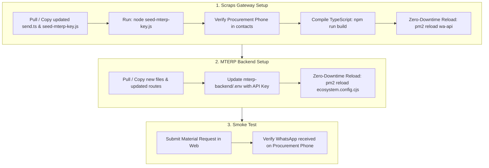

# WhatsApp Integration: Production Deployment & Operations Guide

**System:** MTERP Enterprise System (`mterp-backend`)  
**Gateway:** Scraps WhatsApp Service (`wa-gateway` :8081)  
**Host Target:** Ubuntu Linux / PM2 / MongoDB / Redis  
**Date:** October 2026  
**Document Status:** Production Ready  

---

## 1. Quick Overview

This guide provides the exact, copy-pasteable terminal commands to deploy the **Material Request** and **Cross-Department WhatsApp Notification** integration onto your live production server.



### Critical Production Rules:
1. **Frontend Untouched:** Zero frontend changes. You **do not** need to rebuild or redeploy `mterp-web`. Everything is triggered server-side.
2. **Zero Downtime:** Both PM2 reloads (`wa-api` and `mterp-backend-api`) preserve active user connections without dropping traffic.
3. **Emergency Kill-Switch:** Setting `WA_GATEWAY_ENABLED=false` in `mterp-backend/.env` immediately disables WhatsApp calls if the gateway is paused or undergoing maintenance.

---

## 2. Summary of Changed Files

### In `Scraps` (`../Scraps`):
- `apps/api/src/routes/send.ts` — Added `POST /api/send/department` endpoint and enabled API key auth for `/stats`.
- `seed-mterp-key.js` — Script to register the MTERP API Key into MongoDB `wa_gateway`.

### In `MTERPweb` (`mterp-backend`):
- `src/services/whatsappGateway.js` — Client service with Indonesian phone normalization (`08...` $\rightarrow$ `628...`) and circuit-breaker.
- `src/utils/whatsappTemplates.js` — Indonesian WhatsApp notification templates.
- `src/utils/notify.js` — Extended with `notifyDepartmentWithWA()`.
- `src/routes/requests.js` — Material Request creation and approval/rejection hooks.
- `src/routes/kasbon.js` — Kasbon submission and approval hooks.
- `src/routes/spkl.js` — Overtime final approval hooks.
- `.env` & `.env.example` — Added `WA_GATEWAY_*` variables.

---

## 3. Step-by-Step Production Deployment

---

### STEP 1: Deploy & Build `Scraps` (The WhatsApp Gateway)

Log into your production Ubuntu server and switch to the `Scraps` directory:

```bash
cd /path/to/Scraps
```

#### 1.1 Pull or Sync Latest Code
Ensure the updated `apps/api/src/routes/send.ts` and `seed-mterp-key.js` are present:
```bash
git pull origin main
# (or verify the updated send.ts is in place)
```

#### 1.2 Generate / Seed the Production API Key
Run the seed script against your production MongoDB:
```bash
node seed-mterp-key.js
```

You will see output similar to:
```text
======================================================
✅ MTERP API Key seeded successfully in wa_gateway!
------------------------------------------------------
MTERP_RAW_KEY=sk_mterp_1f8e2ac4ca276bbe2ae0c5ff764dd22f34326599bab242a4
PREFIX=sk_mterp_1
KEY_HASH=eb0ff0c8b5f1b97082b9d28e2aad15c47adaafae9af93abe8190b981f69e6e7b
======================================================
```
📋 **Copy the `MTERP_RAW_KEY` value.** You will paste it into MTERP's `.env` in Step 2.

#### 1.3 Verify Procurement Contact Whitelist
Verify that your Procurement team phone number is active in the `contacts` collection:
```bash
node -e "
const mongoose = require('mongoose');
require('dotenv').config();
async function check() {
  await mongoose.connect(process.env.MONGO_URI || 'mongodb://127.0.0.1:27017/wa_gateway');
  const contacts = await mongoose.connection.collection('contacts').find({ isActive: true }).toArray();
  console.log('\n--- Active Whitelisted Contacts ---');
  contacts.forEach(c => console.log(' • ' + c.name + ' [' + c.department + '] -> ' + c.phone));
  await mongoose.connection.close();
}
check();
"
```

> **Note:** If your Procurement officer is not listed under `Procurement`, add or edit their contact via the Scraps Dashboard (`http://localhost:3005/contacts`) or run:
> ```bash
> node -e "
> const mongoose = require('mongoose');
> async function setProc() {
>   await mongoose.connect('mongodb://127.0.0.1:27017/wa_gateway');
>   await mongoose.connection.collection('contacts').updateOne(
>     { phone: '628XXXXXXXXXX' }, // Replace with real Procurement mobile
>     { \$set: { department: 'Procurement', isActive: true } },
>     { upsert: true }
>   );
>   console.log('✅ Procurement contact set.');
>   await mongoose.connection.close();
> }
> setProc();
> "
> ```

#### 1.4 Compile TypeScript (Mandatory for Production)
PM2 runs compiled code from `apps/api/dist/index.js`. Compile the new TypeScript files:
```bash
npm run build --workspace=apps/api
```
*(Verify output: `api@1.0.0 build > tsc` finishes with exit code 0).*

#### 1.5 Hot-Reload the Gateway Service
```bash
pm2 reload wa-api
```

#### 1.6 Verify Gateway Health
Test the loopback endpoint using `curl`:
```bash
curl -i -H "X-API-Key: YOUR_COPIED_KEY_HERE" http://127.0.0.1:8081/api/send/stats
```
*Expected response: HTTP 200 with `{ "ok": true, "waReady": true, ... }`.*

---

### STEP 2: Deploy `MTERP Backend`

Navigate to your `mterp-backend` directory on the server:

```bash
cd /path/to/MTERPweb/mterp-backend
```

#### 2.1 Pull or Sync Latest Code
Ensure the new services, utilities, and updated routes are present:
```bash
git pull origin main
```

#### 2.2 Configure Production `.env`
Edit your production `.env`:
```bash
nano .env
```
Append or update the following configuration block:
```env
# ── WhatsApp Gateway Integration (Scraps) ────────────────────────────────────
WA_GATEWAY_URL=http://127.0.0.1:8081
WA_GATEWAY_API_KEY=sk_mterp_YOUR_GENERATED_KEY_HERE
WA_GATEWAY_ENABLED=true

# Optional: Dedicated WhatsApp Group ID (e.g. 120363xxxxxxxxxxxx@g.us)
# Leave blank to send to whitelisted individual contacts
WA_PROCUREMENT_GROUP_ID=

# Base URL used for clickable deep links in WhatsApp messages
APP_BASE_URL=https://mterp.yourcompany.com
```
Save and exit: `Ctrl+O` $\rightarrow$ `Enter` $\rightarrow$ `Ctrl+X`.

#### 2.3 Hot-Reload the Backend PM2 Cluster (Zero Downtime)
```bash
pm2 reload ecosystem.config.cjs
```
PM2 will gracefully reload each worker process in the cluster one by one.

#### 2.4 Verify Backend PM2 Logs
```bash
pm2 logs mterp-backend-api --lines 30
```
Confirm the workers restarted cleanly without errors.

---

## 4. Production Verification & Smoke Test

### Test Case A: Material Request Creation Alert
1. Log into your production MTERP Web application.
2. Go to **Materials** (`/materials`) $\rightarrow$ Click **Buat Request**.
3. Fill in a test item:
   - Item: `Semen Gresik 50kg (Test Notifikasi)`
   - Qty: `10 Sak`
   - Urgensi: `High`
   - Keperluan: `Uji coba sistem notifikasi WhatsApp`
4. Submit the form.
5. **Expected Result:**
   - The requester immediately receives a standard success message in the browser.
   - Within 5–15 seconds, the Procurement officer's WhatsApp receives:
     ```text
     📦 *PERMINTAAN MATERIAL BARU (MATERIAL REQUEST)*
     PT MEGA TAMA ENERCO — MTERP RADAR

     Permintaan pengadaan material baru telah diajukan dari lapangan:

     📌 *Detail Pengadaan:*
     • *Item / Material:* *Semen Gresik 50kg (Test Notifikasi)*
     • *Jumlah:* *10 Sak*
     • *Proyek:* ...
     • *Tingkat Urgensi:* 🔴 *URGENT / TINGGI*
     ...
     🔗 *Tinjau & Tindak Lanjut di MTERP:*
     https://mterp.yourcompany.com/materials
     ```

### Test Case B: Material Request Approval Alert
1. In MTERP Web, click **Approve** on the test request and enter your security passphrase.
2. **Expected Result:**
   - Procurement receives a memo confirming approval and directing them to prepare the Purchase Order (PO).
   - If the requester has their phone number in their user profile, they receive an approval confirmation directly on their WhatsApp.

### Test Case C: Monitoring Queues & Delivery Logs
To monitor the dispatch in real time:
```bash
# Monitor WhatsApp gateway dispatch logs
pm2 logs wa-api --lines 20
```
You will see:
```text
📨 [MQ Worker] Processing job ... → 628XXXXXXXXXX@c.us
  ✅ [MQ Worker] Delivered to 628XXXXXXXXXX@c.us
```

---

## 5. Operations & Maintenance

### Emergency Kill-Switch (Zero Downtime)
If WhatsApp delivery needs to be stopped immediately (e.g., during WhatsApp session re-pairing):
1. In `mterp-backend/.env`, set:
   ```env
   WA_GATEWAY_ENABLED=false
   ```
2. Reload MTERP:
   ```bash
   pm2 reload ecosystem.config.cjs
   ```
*Result: MTERP instantly skips all WhatsApp dispatches without crashing, lagging, or failing any user requests.*

### Re-pairing WhatsApp QR Code
If the WhatsApp session in `Scraps` disconnects:
1. Open the Scraps Web Dashboard: `http://localhost:3005` (or via your internal domain / tunnel).
2. Scan the new QR code or request a phone pairing code.
3. Once paired, `isWaReady()` becomes `true`, and all queued or new messages will automatically process.
